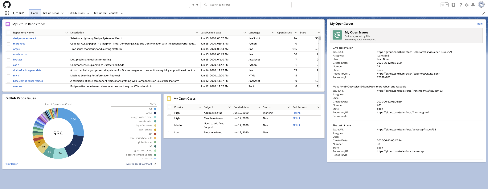

# Salesforce Git Visualizer

This project is a first step in integrating GitHub into Salesforce. Its vision is enabling developers to have a single consolidated view of all the projects they are working on or are interested in, directly in Salesforce, with tight coupling with standard Salesforce objects such as Users, Cases and Work Items (available in [Agile Accelerator app](https://appexchange.salesforce.com/listingDetail?listingId=a0N30000000ps3jEAA)).

## Installation

This project uses [sfdx CLI](https://developer.salesforce.com/tools/sfdxcli) to package, version and deploy its source. It is strongly advised to install this package in a scratch org, developer org or sandbox for testing purposes as long as a stable version has not been deployed.

### Installing sfdx

First, [install sfdx](https://developer.salesforce.com/tools/sfdxcli) for your OS. You can verify that the installation completed succesfully by typing `sfdx` in your favourite terminal. You should have an output looking like:

```sh
Salesforce CLI

VERSION
  # Your sfdx version

USAGE
  $ sfdx [COMMAND]

COMMANDS
  # List of commands

TOPICS
  # List of topics
```

Make sure you have sfdx's latest version by running `sfdx update` command.

> **Note:** Salesforce Extensions for Visual Studio Code makes life easier, by providing nice and easy ways to use (most of) sfdx commands. You can install it by following this [TrailHead module](https://trailhead.salesforce.com/en/content/learn/projects/quick-start-lightning-web-components/set-up-visual-studio-code).

### Deployment

After installing sfdx, you should get authenticated to your dev hub. To do so, you can either run:

```sh
sfdx force:auth:web:login -a <devhub alias> -d
```

Or use Visual Studio Code's extension by typing "authorize dev hub" in the quick actions list.

> **Note:** *-d* option makes this devhub your default one.

> **Note:** As most sfdx commands can be found in Visual Studio Code's extension, in the remainder of this readme we will only list sfdx commands and not their IDE counterpart.

After authorizing your dev hub, you should probably create a new scratch org:

```sh
sfdx force:org:create -f <project-scratch-def.json path> -a <scratch org alias>
```

If you already have created some scratch orgs and get a limits error, you can see your created orgs with :

```sh
sfdx force:org:list
```

And delete the ones you want with:

```sh
sfdx force:org:delete -u <scratch org's alias / username>
```

All you need to do is then to push this package's sources by typing:

```sh
sfdx force:source:push -u <scratch org's alias / username>
```

Assign the GitHubAppUser permission set to the default user:

```sh
sfdx force:user:permset:assign -n GitHubAppUser
```

If you want to have sample data for Case objects, you may import it with:

```sh
force:data:tree:import -f data/Case.json  
```

### Authentication

This project uses OAuth2 authentication to connect Salesforce with GitHub data. The first step that you will need to do is to create either a GitHub App or Oauth App on GitHub side. [This documentation](https://developer.github.com/apps/differences-between-apps/#:~:text=Understanding%20the%20differences%20between%20GitHub,on%20repositories%20within%20an%20organization) can help you choose between both.

In your scratch org which should now contain this project's sources, go to setup, then type in the Quick Find box "Auth. Providers". Then Edit the GitHub Authentication Provider, so that the consumer key + consumer secret correspond to the app you created on GitHub-side. Authorize Endpoint URL should probably point to "https://github.com/login/oauth/authorize", Token Endpoint URL to "https://github.com/login/oauth/access_token".

If you have chosen to use an OAuth App, you need to specify the [default scopes](https://developer.github.com/apps/building-oauth-apps/understanding-scopes-for-oauth-apps/) your app is going to require.

After saving, your users should now be able to authenticate through a Named Credential. To do so, they can go to settings &rarr; Authentication Settings for External Systems &rarr; new &rarr; select Named Credential, GitHubCredentials, your current user, OAuth 2.0, and check "Start Authentication Flow on Save" checkbox.

When saving, this will redirect your users to GitHub so that they can authenticate and accept your application's scope.

> **Note:** In a prod environment, an admin should take care of this authentication procedure and create an "Authentication Settings for External Systems" for all users needing to access the GitHub App. That way end users only have to authenticate to github through their settings.

## Usage

After authenticating, you may access GitHub application through the app selector &rarr; GitHub.

You should see a home page looking like this:


You can then explore the app different features:

* Repositories
* Open Issues per repository
* "My Open Cases" for all cases associated to you, with an optional Pull Request field
* "My open Issues" with your three most recent issues; going to the "GitHub Issues" tab, you should see all the information related to these issues. 
  
> **Note:** You can link Issues to Salesforce Users by filling the custom field "GitHub Username" in your User objects.

## Code of conduct

[Salesforce open-source](https://opensource.salesforce.com/) projects are committed to providing a friendly, safe, and welcoming environment for all. Even though this project is not (yet ?) part of [Salesforce open-source](https://opensource.salesforce.com/) projects, it will abide by its policy.

You may read more in the [Code of Conduct](./CODE_OF_CONDUCT.md).

The goal of this code of conduct is to specify a baseline standard of behavior so that people with different social values and communication styles can work together effectively, productively, and respectfully in our open source community. It also establishes a mechanism for reporting issues and resolving conflicts.

All questions and reports of abusive, harassing, or otherwise unacceptable behavior in a Salesforce open-source project may be reported by contacting the Salesforce Open Source Conduct Committee at ossconduct@salesforce.com.
